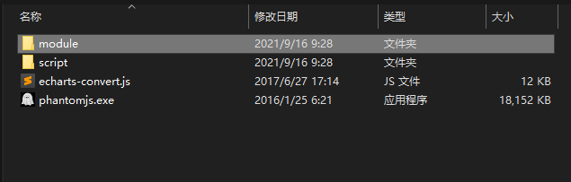
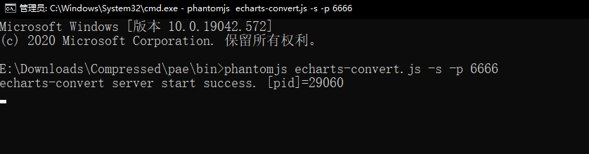

# 通过phantomjs 后台生成echarts图片

### 1.phantomjs

> PhantomJS俗称为：无界面的浏览器。PhantomJS是一个基于webkit的JavaScript API。它使用QtWebKit作为它核心浏览器的功能，使用webkit来编译解释执行JavaScript代码。任何你可以在基于webkit浏览器做的事情，它都能做到。它不仅是个隐形的浏览器，提供了诸如CSS选择器、支持Web标准、DOM操作、JSON、HTML5、Canvas、SVG等，同时也提供了处理文件I/O的操作，从而使你可以向操作系统读写文件等。PhantomJS的用处可谓非常广泛，诸如网络监测、网页截屏、无需浏览器的 Web 测试、页面访问自动化等。

### 2.**[EChartsConvert.js](https://gitee.com/saintlee/echartsconvert)**

> **主要功能：给定ECharts的option参数，生成ECharts图片，并以Base64字符串返回。**

gitee:  [EChartsConvert](https://gitee.com/saintlee/echartsconvert)

### 3.下载
- 下载地址：（github）[phantomEcharts.zip (github.com)](https://github.com/CryanNing/MyStudy/blob/main/pdfreport/tool/phantomEcharts.zip)
- 下载附件的phantomEchart.zip 并解压 打开bin目录文件夹

- 这里我已经将echartsConvert.js包整合到phantomjs 的bin目录文件夹下面了 在此目录打开CMD



```shell
#输入
phantomjs echarts-convert.js -s -p 6666
#  --debug=yes  开启控制台日志打印
#  -s 以服务启动
#  -p 启动 端口  不加 默认为9090
```

- 出现下图 PID=XXX 即启动成功

  

#### 4.测试代码

java通过HttpClient或URLConnection请求，url为http://localhost:9090；GET或POST请求，request参数为opt=optJson；

```
public class EChartsConvertTest {

    public static void main(String[] args) {
        String url = "http://localhost:6666";
        // 不必要的空格最好删除，字符串请求过程中会将空格转码成+号
        //option 选项里面不能有注释！！有注释会报EOF异常！
        String optJson = "{title:{text:'ECharts 示例'},tooltip:{},legend:{data:['销量']},"
                + "xAxis:{data:['衬衫','羊毛衫','雪纺衫','裤子','高跟鞋','袜子']},yAxis:{},"
                + "series:[{name:'销量',type:'bar',data:[5,20,36,10,10,20]}]}";
        optJson="{title:{text:'您在13项素质能力上的评估层级如下:'},legend:{data:['您的层级','平均层级'],left:'right'},radar:{indicator:[{name:'销售（Sales）',max:6500},{name:'管理（Administration）',max:16000},{name:'信息技术（InformationTechnology）',max:30000},{name:'客服（CustomerSupport）',max:38000},{name:'研发（Development）',max:52000},{name:'市场（Marketing）',max:25000}]},series:[{name:'您的层级vs平均层级',type:'radar',data:[{value:[4200,3000,20000,35000,50000,18000],name:'您的层级'},{value:[5000,14000,28000,26000,42000,21000],name:'平均层级'}]}]}";
		//删掉不必要的换行空格等
        optJson = optJson.replaceAll("\\s+", "").replaceAll("\"", "'");
        System.out.println(optJson);
        Map<String, String> map = new HashMap<>();
        map.put("opt", optJson);
        try {
            String post = post(url, map, "utf-8");
            System.out.println(post);
            JSONObject jsonObject = JSON.parseObject(post);
            String data = jsonObject.getString("data");
            System.out.println(data);
     
            GenerateImage(data,"d:/test/test.png");
        } catch (ParseException e) {
            e.printStackTrace();
        } catch (IOException e) {
            e.printStackTrace();
        }
    }

    // post请求
    public static String post(String url, Map<String, String> map, String encoding) throws ParseException, IOException {
        String body = "";

        // 创建httpclient对象
        CloseableHttpClient client = HttpClients.createDefault();
        // 创建post方式请求对象
        HttpPost httpPost = new HttpPost(url);

        // 装填参数
        List<NameValuePair> nvps = new ArrayList<>();
        if (map != null) {
            for (Map.Entry<String, String> entry : map.entrySet()) {
                nvps.add(new BasicNameValuePair(entry.getKey(), entry.getValue()));
            }
        }
        // 设置参数到请求对象中
        httpPost.setEntity(new UrlEncodedFormEntity(nvps, encoding));

        // 执行请求操作，并拿到结果（同步阻塞）
        CloseableHttpResponse response = client.execute(httpPost);
        // 获取结果实体
        HttpEntity entity = response.getEntity();
        if (entity != null) {
            // 按指定编码转换结果实体为String类型
            body = EntityUtils.toString(entity, encoding);
        }
        EntityUtils.consume(entity);
        // 释放链接
        response.close();
        return body;
    }


    public static boolean GenerateImage(String imgStr, String imgFilePath) {// 对字节数组字符串进行Base64解码并生成图片
        if (imgStr == null) // 图像数据为空
            return false;
        BASE64Decoder decoder = new BASE64Decoder();
        try {
            // Base64解码
            byte[] bytes = decoder.decodeBuffer(imgStr);
            for (int i = 0; i < bytes.length; ++i) {
                if (bytes[i] < 0) {// 调整异常数据
                    bytes[i] += 256;
                }
            }
            // 生成jpeg图片
            OutputStream out = new FileOutputStream(imgFilePath);
            out.write(bytes);
            out.flush();
            out.close();
            return true;
        } catch (Exception e) {
            return false;
        }
    }

}
```

